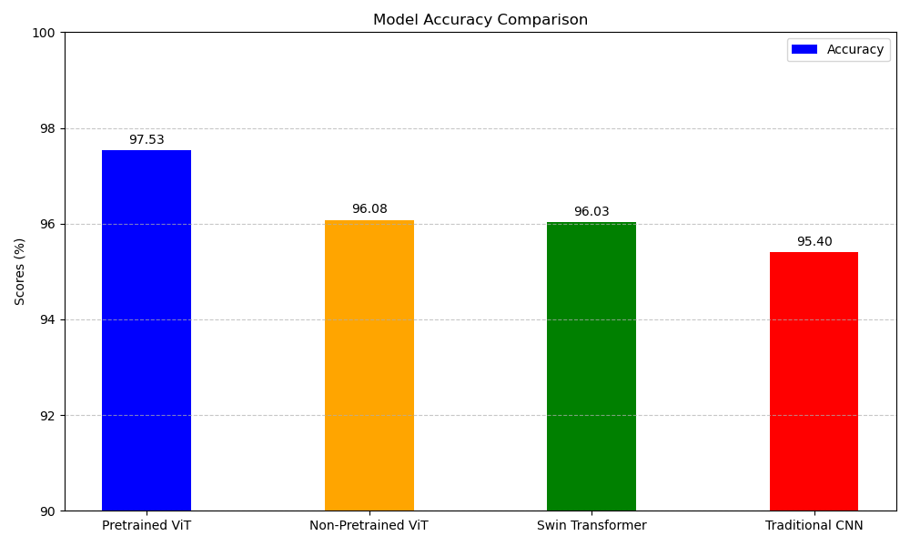

# ViTalia - Malaria Detection using Vision Transformers (ViT)

### Malaria Detection

Malaria is a serious and life-threatening disease caused by *Plasmodium* parasites, transmitted to humans through the bites of infected female *Anopheles* mosquitoes. Though malaria is preventable and curable, it remains a major global health concern.

- **Global Burden**: In 2017, there were approximately 219 million cases of malaria across 90 countries, leading to around 435,000 deaths. The majority of malaria cases and fatalities occurred in the WHO African Region, which bears 92% of cases and 93% of deaths.
- **Affected Populations**: Malaria has a disproportionate impact on children under five and pregnant women, particularly in sub-Saharan Africa. Vulnerable populations in regions with inadequate access to healthcare are at higher risk of severe complications and death.

    
    
<strong>Figure 1: Malaria Cells</strong>

--------------------------------------------------------------------------------------

### Vision Transformers (ViT) and Swin Transformers

Vision Transformers (ViT) represent a breakthrough in computer vision, applying transformer architectures, which were initially designed for natural language processing, to image classification tasks. Unlike traditional Convolutional Neural Networks (CNNs), ViTs treat images as sequences of patches, enabling them to capture long-range dependencies effectively. This makes them particularly effective in binary classification tasks, as they can focus on relevant features throughout the entire image rather than just localized areas.

Swin Transformers build on the ViT framework by introducing a hierarchical structure that allows for both local and global feature extraction. This design not only enhances their power for image classification but also makes them suitable for more complex tasks such as object detection and segmentation, while offering improved training speed and efficiency.

    
    
<strong>Figure 2: ViT and Swin Transformer Architecture</strong>

--------------------------------------------------------------------------------------

### Dataset

The dataset used for training this malaria detection model can be found on Kaggle:
- [Cell Images for Detecting Malaria](https://www.kaggle.com/datasets/iarunava/cell-images-for-detecting-malaria)

This dataset contains images of infected and uninfected cell samples, which are used to train and evaluate the model's performance in detecting malaria.

----------------------------------------------------------------------------------

### References

- [WHO Fact Sheet on Malaria](https://www.who.int/news-room/fact-sheets/detail/malaria)

