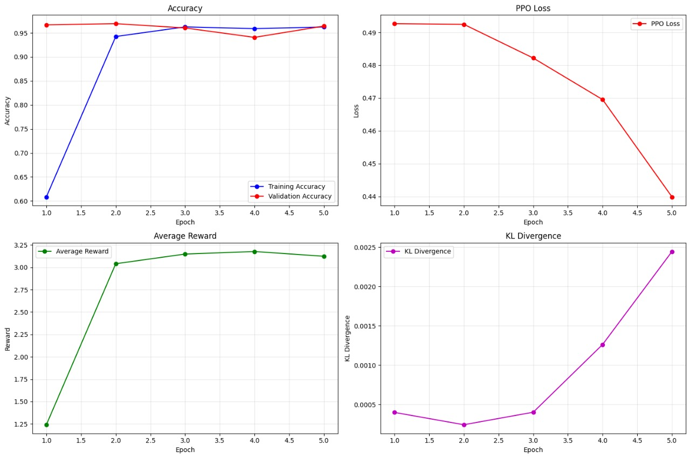

# RL-ViT-alia: Malaria Detection using Reinforcement Learning with Vision Transformers
## Project Overview

RL-ViT-alia (previously "ViTalia") is a novel approach to malaria detection that integrates Vision Transformers (ViT) with advanced AI techniques, including Reinforcement Learning, Chain-of-Thought reasoning, and Retrieval-Augmented Generation. This project aims to create an accurate, interpretable, and reliable system for automated malaria diagnosis from blood smear images.

### Development Phases

- **Phase 1:** Initial development with Vision Transformers for malaria detection, achieving high accuracy in classifying infected vs. uninfected blood cells
- **Phase 2:** Integration of Chain-of-Thought (CoT), Retrieval-Augmented Generation (RAG), and Proximal Policy Optimization (PPO) to enhance performance and interpretability

## Key Features

- **High Accuracy:** Achieves 96.7% accuracy on malaria detection, outperforming traditional CNN approaches
- **Interpretable Decisions:** Generates step-by-step reasoning and visual attention maps to explain diagnostic decisions
- **Confidence Calibration:** Uses reinforcement learning to calibrate confidence levels, reducing both overconfidence and underconfidence
- **Case-Based Reasoning:** Retrieves similar cases from a knowledge base to assist in classification and provide context
- **Balanced Performance:** Optimized to minimize both false positives and false negatives, with particular emphasis on reducing false negatives (missed infections)

## Technical Architecture

The system integrates multiple advanced components:

1. **Vision Transformer (ViT) Backbone:** Leverages transformer architecture for effective feature extraction from blood cell images
2. **Retrieval-Augmented Generation (RAG):** Enhances decisions through reference to similar cases in a knowledge base
3. **Chain-of-Thought (CoT) Reasoning:** Provides step-by-step interpretable reasoning for diagnostic decisions
4. **Proximal Policy Optimization (PPO):** Fine-tunes the model through reinforcement learning to optimize for a custom reward function that balances accuracy, confidence calibration, and explanation quality

## Model Performance

| Model | Accuracy | Precision | Recall | F1 Score |
|-------|----------|-----------|--------|----------|
| Base CNN | 94.20% | 93.15% | 95.05% | 94.09% |
| Non-Pretrained ViT | 96.08% | 95.22% | 97.08% | 96.14% |
| Base ViT (Pretrained) | 95.20% | 94.02% | 94.95% | 94.48% |
| ViT + RAG | 96.21% | 95.89% | 95.76% | 95.82% |
| ViT + CoT | 96.58% | 97.21% | 95.13% | 96.16% |
| Full RAG-CoT-PPO | 96.69% | 97.36% | 96.05% | 96.70% |

<div align="center">

  

  <em>Figure: RL-ViTalia model graphs</em>

</div>

<div align="center">

  

  <em>Figure: Attention Maps produce by CoT based on cell morphology</em>

</div>
## Dataset

The model is trained and evaluated on the "Cell Images for Detecting Malaria" dataset from Kaggle:
- [Cell Images for Detecting Malaria](https://www.kaggle.com/datasets/iarunava/cell-images-for-detecting-malaria)

This dataset contains microscopic images of stained blood cells, both infected and uninfected with malaria parasites.

## Example Output

The model provides comprehensive explanations for each diagnosis:

```
Sample 1:
True Label: Parasitized
Base ViT: Parasitized (confidence: 0.9976)
CoT-PPO: Parasitized (confidence: 0.9648)

Chain-of-Thought Reasoning:
Step 1: The cell boundary was analyzed to assess morphological regularity.
Step 2: Region-level focus revealed potential parasitic inclusions.
Step 3: Attention was paid to the chromatin structure and ring formations.

Conclusion: The cell is likely parasitized with a confidence of 96.5%.
Key infection traits detected include:
- Disrupted membrane boundary
- Chromatin dot visibility
- Parasite-like inclusions within the cytoplasm

Reference Similar Cases:
- Case #1: Parasitized (similarity: 1.5%)
- Case #2: Parasitized (similarity: -3.6%)
- Case #3: Parasitized (similarity: -9.1%)
```

<div align="center">

  

  <em>Figure: Visualization of Chain-of-Thought Reasoning</em>

</div>

## Advantages of the RAG-CoT-PPO Approach

1. **Improved Accuracy:** The combination of techniques achieves higher accuracy than traditional CNN or ViT models alone
2. **Interpretability:** Chain-of-Thought reasoning provides step-by-step explanations crucial for medical applications
3. **Knowledge Integration:** Retrieval-Augmented Generation allows comparison with known examples, enhancing decision quality
4. **Confidence Calibration:** PPO reinforcement learning helps calibrate the model's confidence, particularly important for medical diagnosis
5. **Visual Evidence:** Attention maps provide visual evidence of the model's focus areas, enhancing transparency
6. **Adaptability:** The reinforcement learning framework can be adjusted to emphasize different performance aspects without retraining

## Future Work

- **Efficient Implementation:** Optimizing the architecture for deployment in resource-constrained environments
- **Multi-modal Integration:** Incorporating additional data sources such as patient history and symptoms
- **Improved Explanations:** Developing more sophisticated explanation generation techniques
- **Online Learning:** Implementing mechanisms for continuous improvement from new cases and expert feedback
- **Extension to Other Diseases:** Adapting the approach to other medical imaging tasks
- **Human-AI Collaboration:** Developing interfaces for effective collaboration between healthcare professionals and the AI system